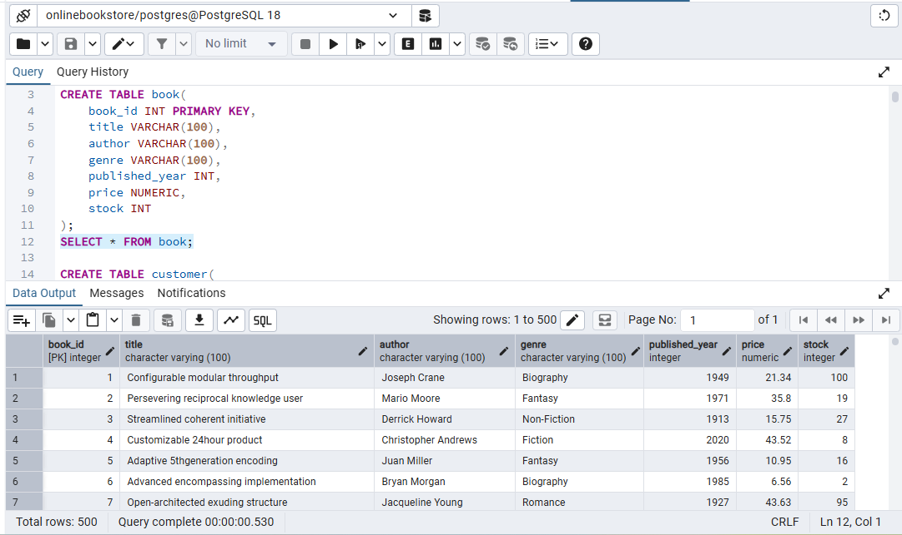
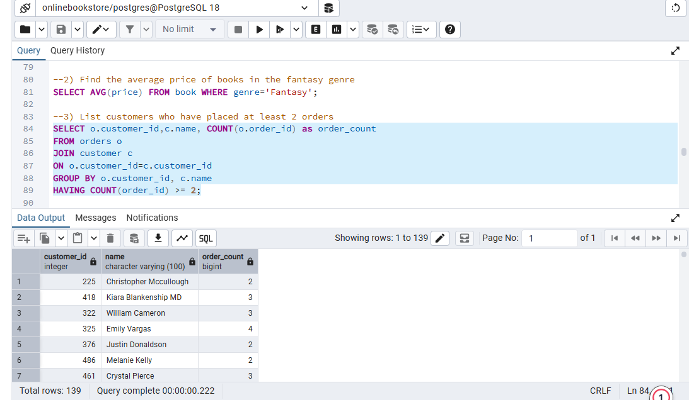
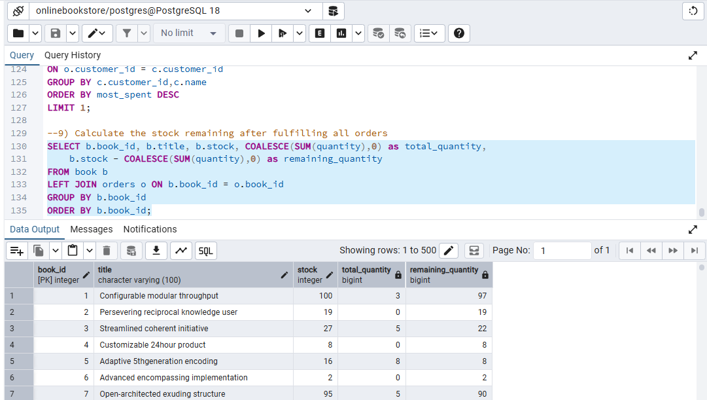

# 📚 Bookstore SQL Project

## Project Title / Headline

📚 **Bookstore Database Analysis using PostgreSQL**
A SQL project designed to analyze an online bookstore database by solving real-world business queries using PostgreSQL.

## **Short Description / Purpose**

This SQL project focuses on querying and analyzing an online bookstore database to extract meaningful business insights. It demonstrates the use of SQL for data retrieval, aggregation, filtering, joins, and analytical problem-solving to support data-driven decision-making.

## **Tech Stack**

The project was built using the following tools and technologies:

* 🐘 **PostgreSQL** – Database management system used to store and manage the data.
* 💻 **pgAdmin 4** – Used for writing, executing, and managing SQL queries.
* 📝 **SQL** – Used for data retrieval, joins, aggregations, filtering, sorting, and analysis.
* 📄 **File Format** – `.sql` for database creation and SQL queries.

## **Data Source**

The dataset consists of an online bookstore database containing information about books, customers, and orders. The data was imported into PostgreSQL from a CSV file for analysis.

## **Features / Highlights**

### **Business Problem**

Bookstores need to analyze customer purchases, book sales, and inventory to understand sales performance, identify popular books, and improve business decisions. SQL enables efficient analysis of this data.

### **Goal of the Project**

* Analyze book sales and customer orders.
* Identify the most frequently ordered books.
* Track customer purchasing behavior.
* Calculate sales-related metrics.
* Answer real-world business questions using SQL.

### **Key SQL Concepts Used**

* SELECT & WHERE
* ORDER BY & LIMIT
* GROUP BY & HAVING
* INNER JOIN & LEFT JOIN
* Aggregate Functions (`COUNT`, `SUM`, `AVG`, `MIN`, `MAX`)
* COALESCE
* Aliases

### **Business Questions Solved**

* Retrieve books by genre.
* Find the average price of books.
* List customers who placed at least two orders.
* Find the most frequently ordered book.
* Calculate the total quantity of books sold by each author.
* Find the customer who spent the most on orders.
* Display books that have never been ordered.
* Show the top three most expensive Fantasy books.

## **Business Impact & Insights**

* Identified best-selling books and customer purchasing patterns.
* Measured total sales quantity by author.
* Found high-value customers based on spending.
* Identified books with no orders to support inventory decisions.
* Demonstrated practical SQL techniques for solving business analytics problems.

## 📸 Screenshots

### Book Table

### Customers with At Least 2 Orders

### Remaining Stock Analysis

